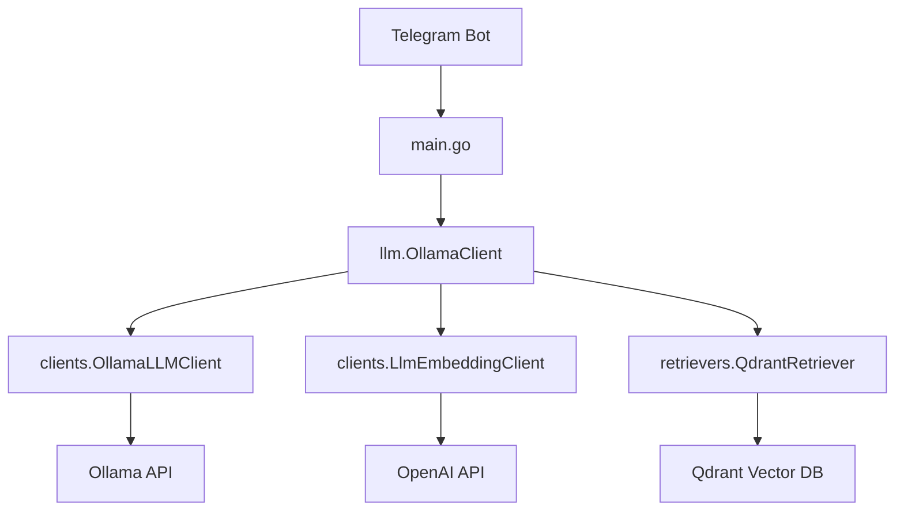
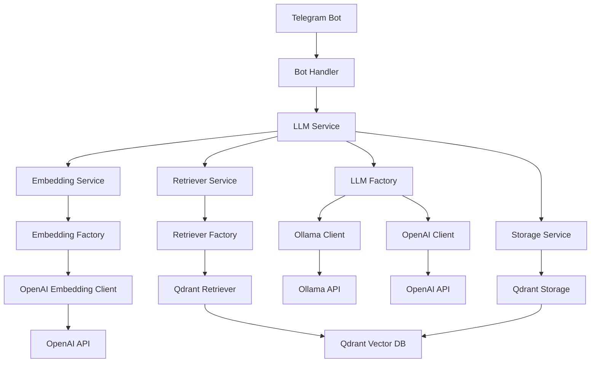

# Архитектурный Анализ и Рекомендации для Go-LLM-RpgGameMaster

## Выявленные Архитектурные Проблемы

### 1. Организация Кода
- **Дублирование функциональности**: Пакеты `llm/` и `clients/` содержат пересекающуюся функциональность, что создает путаницу
- **Непоследовательные названия**: Компоненты имеют несогласованные имена (например, `OllamaLLMClient` vs `OllamaClient`)
- **Разрозненные интерфейсы**: Интерфейсы определены в разных пакетах без четкой структуры

### 2. Взаимодействие Компонентов
- **Жесткая связность**: Компоненты напрямую создают свои зависимости вместо использования внедрения зависимостей
- **Смешанная обработка ошибок**: Некоторые функции возвращают ошибки, а другие вызывают `log.Fatal()`
- **Вложенные таймауты**: Несколько уровней создают собственные таймауты контекста, что приводит к непредсказуемому поведению

### 3. Проблемы Масштабируемости
- **Однопоточная обработка**: Все операции выполняются последовательно без возможности параллелизации
- **Отсутствие пула соединений**: Нет управления пулом соединений для HTTP клиентов
- **Недостаточная наблюдаемость**: Отсутствуют метрики и структурированное логирование

## Предлагаемые Технические Решения

### 1. Рефакторинг Структуры Кода

#### Новая структура проекта:
```
go-llm-rpggamemaster/
├── cmd/
│   └── bot/
│       └── main.go
├── internal/
│   ├── config/
│   ├── llm/
│   │   ├── client.go (интерфейсы)
│   │   ├── ollama/
│   │   │   ├── client.go
│   │   │   └── options.go
│   │   ├── openai/
│   │   │   ├── client.go
│   │   │   └── options.go
│   │   └── factory.go
│   ├── retriever/
│   │   ├── retriever.go (интерфейс)
│   │   └── qdrant/
│   │       └── client.go
│   ├── storage/
│   │   └── qdrant/
│   │       └── client.go
│   └── bot/
│       ├── handler.go
│       └── router.go
```

#### Улучшения:
- Консолидация функциональности LLM в едином пакете
- Четкое разделение интерфейсов и реализаций
- Централизованное управление конфигурацией

### 2. Оптимизация Взаимодействия Компонентов

#### Внедрение Зависимостей:
- Использование DI контейнера или ручного внедрения зависимостей
- Передача зависимостей через конструкторы
- Использование фабрик для сложного создания объектов

#### Улучшенная Обработка Ошибок:
- Единый подход к обработке ошибок (возврат ошибок, решение принимает вызывающая сторона)
- Обертывание ошибок с помощью `fmt.Errorf` и верба `%w`
- Определение пользовательских типов ошибок для различных категорий сбоев

### 3. Улучшение Масштабируемости

#### Параллелизм:
- Реализация пула воркеров для параллельной обработки запросов LLM
- Ограничение частоты запросов для предотвращения перегрузки внешних сервисов
- Очереди запросов для graceful handling пиковых нагрузок

#### Управление Ресурсами:
- Пулы соединений для HTTP клиентов и подключений к БД
- Управление памятью с ограничениями размера кэша и политиками вытеснения
- Очистка ресурсов при отмене контекста

#### Наблюдаемость:
- Сбор метрик Prometheus для мониторинга производительности
- Структурированное логирование с ID корреляции
- Эндпоинты проверки состояния для мониторинга

## Диаграммы Архитектуры

### Текущая Архитектура:


### Предложенная Улучшенная Архитектура:


Эти изменения значительно улучшат структуру кода, повысят гибкость системы и обеспечат лучшую масштабируемость для будущего роста проекта.